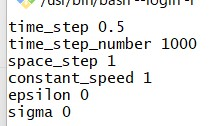

# 使い方
## 入力画像の幅と高さを知る

次を実行する。
```
./LevelSet.exe \
       --input /c/data/levelset/inputs/dreamworks.jpg \
       --mode info
```
引数の意味は以下の通り
- input: 入力画像へのパス（jpegのグレイ画像のみサポート）
- mode: 幅高さを知るときはinfoを指定する。

次が出力される。
```
  width :   820
 height :   376
```

## 初期円を設定する
次を実行する。
```
./LevelSet.exe \
        --input /c/data/levelset/inputs/dreamworks.jpg \
        --output /c/data/levelset/outputs \
        --mode initial \
        --x 494 \
        --y 164 \
        --radius 12 \
        --color 128
```
引数の意味は以下の通り
- input: 入力画像へのパス（jpegのグレイ画像のみサポート）
- output: 出力フォルダへのパス
- mode: 初期円を描画するときはinitialを指定する。
- x: 円の中心のx座標
- y: 円の中心のy座標
- radius: 円の半径
- color: 円を描画する際の色。[0,255]の範囲で決める。
 
実行のあとoutputフォルダの中に以下2つのファイルができる。

- initial_loop.jpg: 初期円が描画された画像
- circle_parameters.txt: 円の中心(x,y)と半径rと色が記載されたテキストファイル

## LevelSet法を実行する
次を実行する。
```
./LevelSet.exe \
        --input /c/data/levelset/inputs/dreamworks.jpg \
        --output /c/data/levelset/outputs \
        --mode final \
        --x 494 \
        --y 164 \
        --radius 12 \
        --color 128 \
        --config /c/projects/levelset/x64/Release/levelset_config.txt \
        --interval 10
```
引数の意味は以下の通り。
- input: 入力画像へのパス（jpegのグレイ画像のみサポート）
- output: 出力フォルダへのパス
- mode: 初期円を描画するときはinitialを指定する。
- x: 円の中心のx座標
- y: 円の中心のy座標
- radius: 円の半径
- color: 円を描画する際の色。[0,255]の範囲で決める。
- config: 後述する設定ファイルへのパス
- interval: 画像を保存する間隔

設定ファイル内の中身は以下の通り



フォーマットは
```
<label><space><value>
```
である。意味は以下の通り。

- time_step: 時間発展の刻み幅
- time_step_number: 時間発展の繰り返し数
- space_step: 空間刻み幅。x軸方向、y軸方向ともに同じ。
- constant_speed: 速度関数の定数部分の値。円を内側に収縮させるなら負の値を、その逆なら正の値を設定する。
- epsilon: 速度関数に現れるεの値
- sigma: 入力画像に施すガウスぼかしの度合い。

実行するとoutputフォルダ内に時々刻々変化する閉曲線を描画した画像が出力される。上の場合、時間発展は1000ステップ（time_step_number）行われ、10（interval）ごとに画像が保存される。
