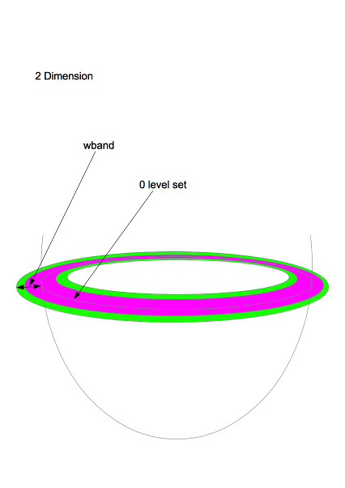
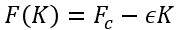

# 使い方
## 引数なしで実行する

次を実行する。
```
./LevelSet2.exe
```
次が出力される。
```
allowed options:
  --help                produce help message
  --dim arg             set either 2 or 3
  --verbose             print verbose description
  --input arg           set GRAY image path in 2D/set pattern in 3D
  --wband arg           set width of band
  --wreset arg          set width to reset
  --time_step arg       set time step
  --gain arg            set gain
  --constant_speed arg  set constant speed
  --speed_threshold arg set speed threshold
  --left arg            set left of initial rectangle
  --top arg             set top of initial rectangle
  --right arg           set right of initial rectangle
  --bottom arg          set bottom of initial rectangle
  --front arg           set front of initial rectangle (not used in 2D)
  --back arg            set back of initial rectangle (not used in 2D)
```
引数の意味は以下の通り。
- dim: 対象物の次元を指定する。画像なら2、立体物なら3である。
- verbose: デバッグ情報も出力する。値を書く必要のない引数である。
- input: 画像ならグレイ画像（jpegのみサポート）へのパスを、立体物ならSTLへのパスを書く。
- wband: Narrow Band Level Set法を採用している。波面（境界面）の計算領域の幅を設定する（下図参照）。
- wreset: Level Set法の精度を高めるため、ある計算ステップごとに波面の初期化を行います。その引き金となる領域の幅を設定する（下図参照）。
- time_step: Level Set法では波面を時間発展させる。その時間幅を設定する。
- gain: 波面の速度は定数項と波面の曲率に依存する項からなる。後者の割合を設定する（下図参照）。
- constant_speed: 波面速度の定数項（下図参照）
- speed_threshold: この速度以下の場合、波面速度を0とみなす。
- left: 最初に与える矩形あるいは直方体のサイズを指定する。
- top : 最初に与える矩形あるいは直方体のサイズを指定する。
- right: 最初に与える矩形あるいは直方体のサイズを指定する。
- bottom: 最初に与える矩形あるいは直方体のサイズを指定する。
- front: 最初に与える矩形あるいは直方体のサイズを指定する。3Dの場合のみ。
- back: 最初に与える矩形あるいは直方体のサイズを指定する。3Dの場合のみ。


上図において、wbandのうち緑で示した領域の幅がwresetである。波面が緑の領域に到達すると、波面の再初期化実行される。

速度関数は次式で定義される。



第1項がcontant_speedに、第2項のεがgainに相当する。第2項は曲面を滑らかにする効果を持つ。Kは曲率を表す。

## 3Dの場合
次を実行する。
```
./LevelSet2.exe \
        --dim 3 \
        --verbose \
        --input "C:\data\arigis_datas\fr_vectors_3M\normalized_stls\S6617_DAK0319---.stl" \
        --wband 5 \
        --wreset 2 \
        --time_step 1  \
        --gain 0.1 \
        --constant_speed -1 \
        --speed_threshold 0.05 \
        --left 0 \
        --top 0 \
        --front 10 \
        --right 190 \
        --bottom 190 \
        --back 190
```
ウィンドウが起動しOpenGLにより3D形状が描画される。キーボードから次の操作が可能になる。
- ESC: 終了します。バグってる？終わらない。
- p: 一時停止します。
- f: 波面(front)の描画を有効・無効にします。
- o: 物体(object)の描画を有効・無効にします。
- <: 視点を物体に近づけます。
- \>: 視点を物体から遠ざけます。
- u: x軸周りに回転します（右ねじ）。
- n: x軸周りに逆回転します。
- h: y軸周りに回転します（右ねじ）。
- j: y軸周りに逆回転します。